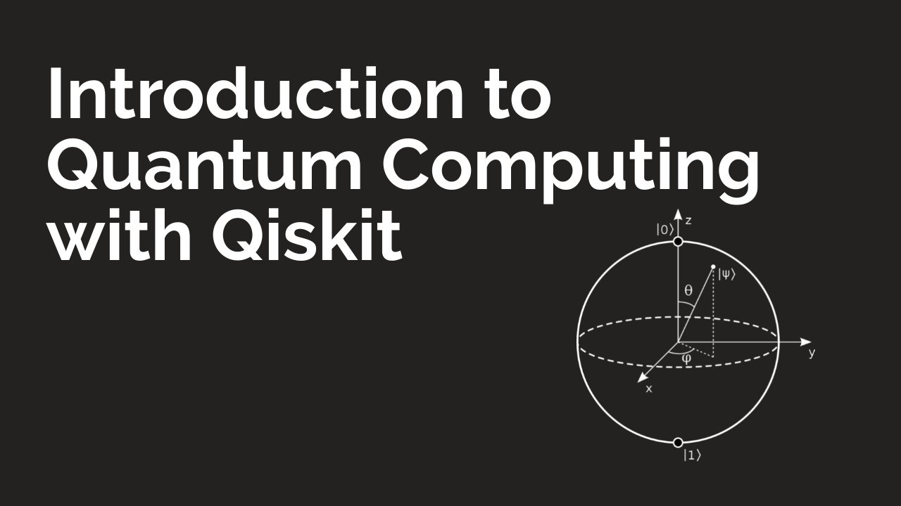

Pruebas de programación Cuántica. Qiskit. IBM.
Héctor Ayuso Martín.

Este repositorio contiene una serie de cuadernillos Jupyter Notebook con programación cuántica, utilizando la libreria de IBM Qiskit.
La idea de este repositorio es demostrar y visualizar conceptos de la física cuántica aplicada a la computación, y sobre todo, la documentación de dichos experimentos, 
en el ejericicio de disponer de mas documentación en Castellano.
Los conceptos aplicados en este repositorio son de un nivel iniciación , como resultado de mi propia inquietud sobre la computación cuántica, a raiz de un showcase de 
Microsoft Majorana 1 ,realizado un par de días antes de la creación de este readme.txt.

En el primer Notebook, Este experimento implementa y visualiza el entrelazamiento cuántico. Se construye un circuito con puertas H y CNOT para crear 
pares de qubits entrelazados, y se analizan sus correlaciones tras la medición.

En el segundo Notebook, llamado colapso_qubit_en_superposicion_cuantica, realizamos dos experimentos: Uno llevado a cabo en una QPU real, y otro en un backend simulador
utilizando qiskit Aer. El experimento trata de observar el colapso de un qubit en superposición |+) a sus dos estados básicos |0) y |1).

El en tercer Jupyter Notebook, con nombre 1.3-generador_cuantico_numeros_aleatorios, generamos un número aleatorio a traves de una QPU real, con forma de un bitString
de 8 bits. Más tarde utilizamos el número como valor de Seed, para generar una pseudo-aleatoriedad local robusta en nuestra programación clásica. Esto es verdaderamente
util en ciberseguridad, simulaciones y comunicación segura (criptografía).

